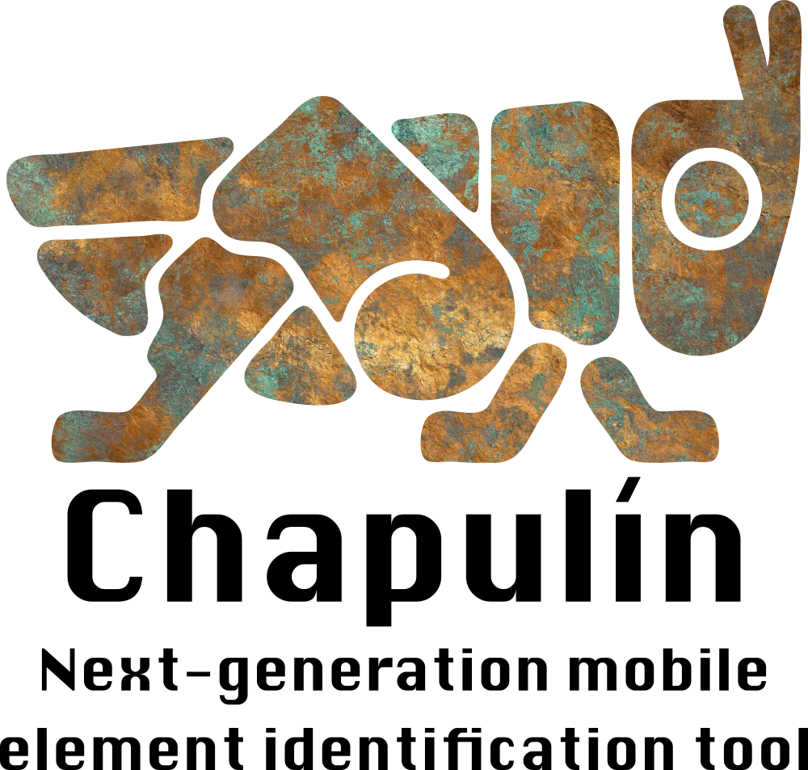

## _Chapulin_ : Next-generation genomic mobile element and structural variant identification tool



# MindReader

<!-- [](https://DanielRivasMD.github.io/Chapulin/stable) -->
<!-- [](https://DanielRivasMD.github.io/Chapulin/dev) -->
<!-- [](https://travis-ci.com/DanielRivasMD/Chapulin) -->
<!-- [](https://codecov.io/gh/DanielRivasMD/Chapulin) -->

## Table of contents

- [Overview](#overview)
- [Installation](#installation)
  - [Homebrew](#via-homebrew-for-macos)
  - [APT](#via-apt-for-debian-based-linux-distros)
  - [Cargo](#via-cargo-for-linux-windows-or-macos)
  - [GitHub](#from-github-release)
  - [Source](#building-from-source)
- [Testing](#testing)
  - [Running tests](#run-tests)
- [Documentation](#documentation)
  - [Usage](#usage)
  - [ME subcommand](#me-subcommand)
  - [SV subcommand](#sv-subcommand)
  - [CR subcommand](#cr-subcommand)
  - [GC subcommand](#gc-subcommand)
  - [AC subcommand](#ac-subcommand)
- [Examples](#examples)
  - [Config](#example-chapulin-config)
  - [ME subcommand](#example-chapulin-me-subcommand)
  - [SV subcommand](#example-chapulin-sv-subcommand)
  - [CR subcommand](#example-chapulin-cr-subcommand)
  - [GC subcommand](#example-chapulin-gc-subcommand)
  - [AC subcommand](#example-chapulin-ac-subcommand)
- [For the curious](#chapulin-for-the-curious)
  - [Etimology](#etimology)
  - [Cultural reference](#cultural-reference)
- [Acknowledgements](#acknowledgements)
- [License](#license)


## Overview

_**Chapulin**_ is a robust, portable and blazing fast tool to identify mobile element insertions as well as structural variants in resequenced population data with a reference assembly.
_**Chapulin**_ uses alignment files (SAM) to scan putative mobile element / structural variant associated reads and then perform calls based on a select arbitrary threshold or a calculate probability threshold.
_**Chapulin**_ 's input and output formats are fully compatible with commonly used software, e.g. RepeatModeler.


_**Chapulin**_ offers two different scanning modes:

  - [Mobile Element identification (ME)](#me-subcommand).

  - [Structural Variant identification (SV)](#sv-subcommand).

Additionally, to improve user experience, _**Chapulin**_ offers [Cache Registering (CR)](#cr-subcommand), [Generate Configuration (GC)](#gc-subcommand) and [AutoCompletion (AC)](#ac-subcommand).


## Installation


<!-- TODO: -->
**Soon to come**

### Via Homebrew (for macOS)

Prerequisites:

- [Homebrew](https://brew.sh/)

```
brew install danielrivasmd/chapulin
```


<!-- TODO: -->
**Soon to come**

### Via APT (for Debian-based Linux distros)

```
curl -SsL https://fbecart.github.io/ppa/debian/KEY.gpg | sudo apt-key add -
sudo curl -SsL -o /etc/apt/sources.list.d/fbecart.list https://fbecart.github.io/ppa/debian/fbecart.list
sudo apt update
sudo apt install chapulin
```


<!-- TODO: -->
**Soon to come**

### Via Cargo (for Linux, Windows or macOS)

Prerequisites:

- [Rust toolchain](https://rustup.rs/)

```
cargo install chapulin
```


<!-- TODO: -->
**Soon to come**

### From Github release

Simply download the release binary for your operating system. _**Chapulin**_ is self-contained so it does not need dependencies.


### Building from source

_**Chapulin**_ is written in Rust, so you'll need to grab a [Rust installation](https://rustup.rs/) in order to compile it.

To build _**Chapulin**_ :

```
git clone https://github.com/DanielRivasMD/Chapulin
cd Chapulin
cargo build --release
./target/release/chapulin --version
Chapulin 0.1.0
```

## Testing

### Run tests

To run the test suite, use:

```
cargo test
```


## Documentation

### Usage

Use `chapulin help` or `chapulin -h` or `chapulin --help` to display help on commandline. Running `chapulin` with no arguments nor flags also triggers help.

```
chapulin 0.1.0
Daniel Rivas <danielrivasmd@gmail.com>


Chapulin: Mobile Element Identification

Software for mobile element identification in resequenced short-read data with a reference genome.


        Available subcommands are:

Mobile Element (ME): performs sequence similarity search to a customized mobile element library and
insertion calls by probability or a set threshold. Aliases: 'me', 'MobileElement'.

Structural Variant (SV): performs read selection based on alignment data and variant calls by
probability or a set threshold. Aliases: 'sv', 'StructuralVariant'.

Cache Registering (CR): checks for reference genome and mobile element library cache in
configuration directory. In case caches are not found, reads files and writes cache. Aliases: 'cr',
'CacheRegistering'.

Generate Configuration (GC): generates a configuration template. Observe that not all values from
config file are used at all times. Aliases: 'gc', 'GenerateConfiguration'.

AutoCompletion (AC): generates autocompletions to stdout for your shell. Pipe into a file and
install to get help when using Chapulin. See `chapulin AC --manual` for details. Aliases: 'ac',
AutoCompletion'.


USAGE:
    chapulin [SUBCOMMAND]

FLAGS:
    -h, --help       Prints help information
    -V, --version    Prints version information

SUBCOMMANDS:
    AC      AutoCompletion [aliases: ac, AutoCompletion]
    CR      Cache Registering [aliases: cr, CacheRegistering]
    GC      Generate Configuration [aliases: gc, GenerateConfiguration]
    ME      Mobile Element Identification [aliases: me, MobileElement]
    SV      Structural Variant Identification [aliases: sv, StructuralVariant]
    T       Testing
    help    Prints this message or the help of the given subcommand(s)
```


### ME subcommand

Mobile Element mode is meant for scanning mobile elements in a host genome, such as LTR-elements. This mode depends on an alignment file to the desire reference, for the purpose of locating putative insertions on chromosomal coordinates, and a mobile element library, which can be produced by using RepeatModeler on a reference genome. Alternatively, a customized library can be used, which makes it ideal to adapt _**Chapulin**_ 's search algorithm for other purposes, such as orphan gene discovery. [Example Mobile Element subcommand](#example-chapulin-me-subcommand).


### SV subcommand

Structural Variant mode will scanned for structural variants in a host genome, for instance insertions, duplications, inversions. The algorithm relies on read length, read depth and read orientation provided by the raw reads and the alignment file. Additionally, a list of known structural variant coordinates can be input to enhance the possibility of identification. [Example Structural Variant subcommand](#example-chapulin-sv-subcommand).


### CR subcommand

Cache Registering mode can write cache files to read from, which will improve running time. This is useful in case you might want to analyze several individuals using a single mobile element library or a single reference genome. [Example Cache Registering subcommand](#example-chapulin-cr-subcommand).


### GC subcommand

_**Chapulin**_ does not come with a configuration file by default. However by using Generate Configuration (GC) you can generate a editable `toml` file with preloaded defaults. In case you make a mistake editing the configuration, _**Chapulin**_ 's error handling will let you know exactly what failed and display examples to help you fix it. [Example Generate Configuration subcommand](#example-chapulin-gc-subcommand).


### AC subcommand

In case you want to explore _**Chapulin**_ interactively, you might want to install autocompletion for your shell by running AutoCompletion (AC). Specific instructions on how to install these autocompletions for your shell can be found with the flag `--manual`. You can also preview your run by running any command with the flag `--dry-run`. [Example AutoCompletion subcommand](#example-chapulin-ac-subcommand).


## Examples

<!-- TODO -->
**Soon to come**

### Example `chapulin` config

Below you can find a config example. Please observe that you can also obtain a config template by using `Generate Configuration` or `GC` command from _**Chapulin**_.

```toml
```


<!-- TODO: 
finish examples
-->

### Example `chapulin ME` subcommand

```
chapulin ME -c <CONFIG>
```


### Example `chapulin SV` subcommand

```
chapulin SV -c <CONFIG>
```


### Example `chapulin CR` subcommand

```
chapulin CR
```


### Example `chapulin GC` subcommand

```
chapulin GC
```


### Example `chapulin AC` subcommand

```
chapulin AC
```

## _Chapulín_ for the curious

### Etimology

The word _chapulín_ derives from Náhuatl _chapōlin_, where the compounds _chapā[nia]_ and _ōlli_ mean "to bounce" and "rubber", respectively. Thus meaning "insect that bounces like rubber".


### Cultural reference

Inhabitants and visitors of Mexico City will be familiar to the 'Chapulín' image for its reference to the beautiful "Chapultepec" or "Chapulín's hill" forest, castle and metro station. It also alludes to the delicious "chapulín's tacos" eaten in Central and South Mexico.


## Acknowledgements


## License

_**Chapulin**_ is distributed under the terms of the GNU GENERAL PUBLIC LICENSE.

See [LICENSE](LICENSE) for details.
